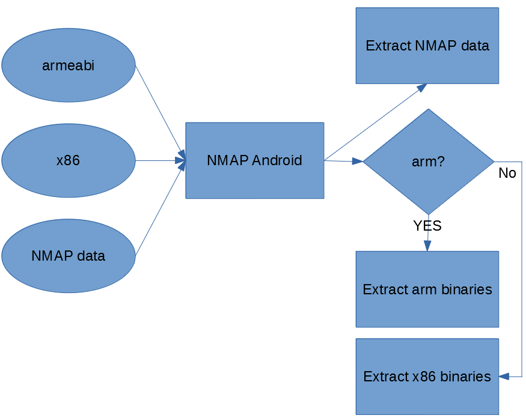
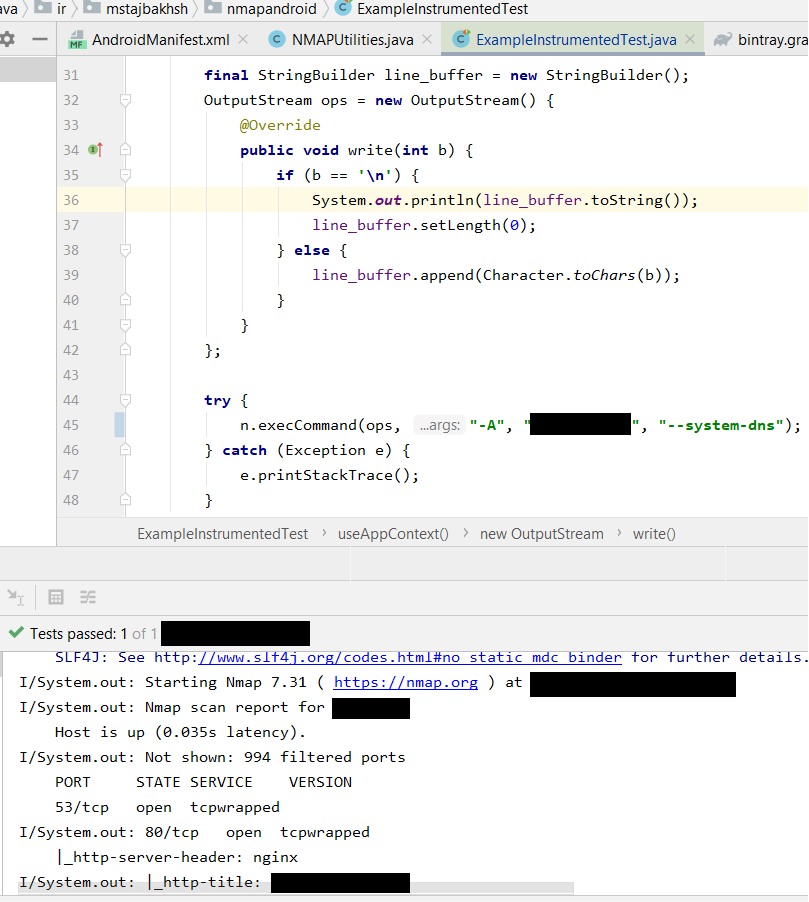

# NMAP Android

This library include the NMAP binary for x86 and armeabi architectures.

## Features
This library is based on **[kost/nmap-android](https://github.com/kost/nmap-android)** repository at GitHub. There are compiled versions of NMAP for different architectures including:
* arm64
* armeabi
* mips
* mips64el
* x86
* x86_64

The difference of NMAPAndroid is that this library can be used as an API to install and run NMAP with custom commands. This library contains the binary data for arm and x86 based systems. The following flowchart shows the process of the NMAP Android installation.




## Including Library In Your Project

Including the library is very simple. Just add the following dependency in your app level gradle file:

```shell
implementation 'ir.mstajbakhsh:nmap-android:1.0.0'
```

The only needed permission for the library is INTERNET which should be included in Manifest:

```xml
<uses-permission android:name="android.permission.INTERNET" />
```


## Sample Code

The code is very simple. Just create a **NMAPUtilities** instance with a *context*. After that call *startInstallation()*. It will install automatically if it was not installed. After that pass an **OutputStream** and **NMAP Params** to the NMAPUtilities instance. That's it! :tada:

Here is the code:

```java
NMAPUtilities n = new NMAPUtilities(context);
n.startInstallation();

final StringBuilder line_buffer = new StringBuilder();
OutputStream ops = new OutputStream() {
	@Override
    public void write(int b) {
    	if (b == '\n') {
            System.out.println(line_buffer.toString());
            line_buffer.setLength(0);
        } else {
            line_buffer.append(Character.toChars(b));
        }
    }
};

try {
    n.execCommand(ops, "-A", "192.168.1.0/24", "--system-dns");
} catch (Exception e) {
    e.printStackTrace();
}
```

Here is the sample output:




# Donate

:coffee: Don't forget to buy me a cup of coffee 

My bitcoin wallet address:

**1F5uiEmdCLJX5KktWHE1wkc63feKJYMmxS**


# Contact

You can reach me at my web site available at: [https://mstajbakhsh.ir](https://mstajbakhsh.ir/)